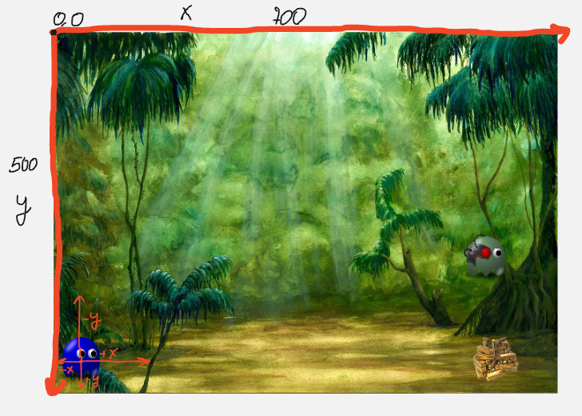

# Maze game
В цій гілці ми продовжемо працювати над грою "Maze"
і поочнемо з постановки зачі
<li>Пересування гравця</li>
<li>Пересування ворога</li>

почнемо з написання класу гравця Player де реалізуємо метод пересування 
````
class Player(GameSprite):
    def update(self):
        keys = key.get_pressed() # отрумуємо нажату клавішу
        if keys[K_LEFT] and self.rect.x > 0: # перевіряємо чи нажали клавішу ліворуч 
            self.rect.x -= self.speed
        if keys[K_RIGHT] and self.rect.x < 700 - 80: # перевіряємо чи нажали клавішу праворуч 
            self.rect.x += self.speed
````
Можно побачити ще одну перевірку 
````
and self.rect.x > 0
````
ми беремо прямокутник гравця, а точніше його х кординату і перевіряємо чи не вийшов він за ліву границю

тобото щоб пересувати нашого гравця від 430(розмір гравця) до 0 по y (вгору та низ) нам потрібно змінювати позицію прямокутника по y
````
        if keys[K_UP] and self.rect.y >= 0:
            self.rect.y -= self.speed
        if keys[K_DOWN] and self.rect.y <= 440:
            self.rect.y += self.speed
````
пересування гравця готово!<br>
Переходимо до написання класу ворога який вже буде пересуватися автоматично (вліво та вправо)
````
class Enemy(GameSprite):
    direction = False

    def update(self):
        if not self.direction: # переверяємо я яку сторону потрібно пересуватися
            self.rect.x -= self.speed
        else:
            self.rect.x += self.speed

        if self.rect.x <= 470: # перевіряємо заданий діапазон
            self.direction = True # встановлюємо відповідний шлях(праворуч)
        if self.rect.x > 700 - 80:
            self.direction = False
````